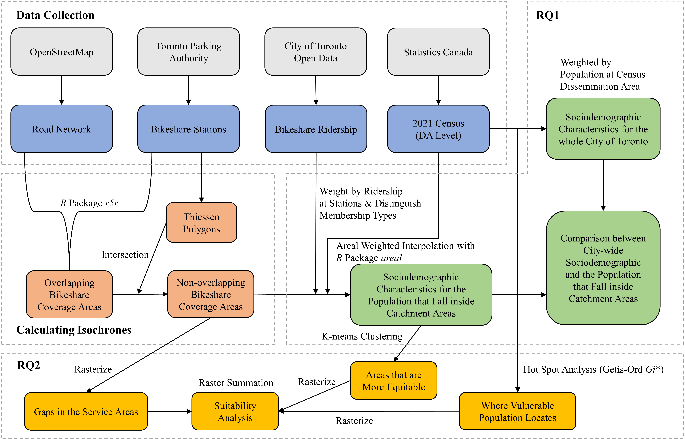

# Toward Equitable Service Provision: A Catchment Area Analysis of The Bike Share Toronto System

## Authors: 
- Filip Panaitescu
- Shixiang Xing
- [Zehui Yin](https://zehuiyin.github.io/), [zehuiyin@gmail.com](mailto:zehuiyin@gmail.com)

## Supervision: 
- [Dr. Glenn Brauen](https://www.utsc.utoronto.ca/geography/glenn-brauen)

## Project Overview:
This repository contains the source code for the R-based GIS analysis of the project **Toward Equitable Service Provision: A Catchment Area Analysis of The Bike Share Toronto System**. This project was completed for the course [GGRD30H3: GIS Research Project](https://utsc.calendar.utoronto.ca/course/ggrd30h3) at the University of Toronto Scarborough in Winter 2024.

## Research Questions:
This project addresses the following two research questions:
1. How equitable is the access to Bike Share Toronto for all Toronto residents, especially for population subgroups based on gender, income or ethnicity?
2. Which Bike Share Toronto service areas have higher or lower levels of equity, and where should the system expansion be prioritized to improve the service provision equity?

## Repository Contents:
To optimize storage, this repository hosts selected intermediate and final results data, excluding any extensive raw datasets. Access to the raw data can be obtained through the provided data source [link](./Data/data_source.xlsx).

## Project Status:
Currently, the project is still a work in progress. The final report and poster will be posted in this repository in the summer.

## Workflow:
The workflow diagram below outlines the project’s process. It should be noted that certain analyses were performed using ArcGIS Pro, for which the source code is not available.

